<div align="center">

# 📚 BookStore

### Website bán sách trực tuyến bằng Laravel

**Đồ án xây dựng hệ thống thương mại điện tử bán sách với Laravel 12, Tailwind CSS 4, Vite 6 và MySQL/MariaDB.**


</div>

---
## 👨‍💻 Author / Creator
**Ngô Thị Minh Phương** 
* GitHub: https://github.com/mfuongg
* Email: fuongm06@example.com

---

## 📖 Giới thiệu

**BookStore** là một website bán sách trực tuyến được xây dựng trên nền tảng **Laravel 12**, áp dụng kiến trúc **MVC** và được chia thành hai phân hệ chính:

- 🛍️ **Client** — dành cho khách hàng mua sách.
- 👑 **Admin** — dành cho quản trị viên quản lý hệ thống.

Hệ thống cung cấp các chức năng từ duyệt sách, tìm kiếm, giỏ hàng, đặt hàng, đánh giá, yêu thích cho tới quản trị sách, danh mục và đơn hàng.

### 🎯 Mục tiêu của dự án

Dự án được xây dựng nhằm mô phỏng một hệ thống thương mại điện tử hoàn chỉnh, đồng thời áp dụng các kiến thức về:

- Laravel MVC
- Routing và Middleware
- Eloquent ORM
- Authentication & Authorization
- Database Migration
- Transaction
- CRUD
- Blade Template
- Tailwind CSS
- Vite
- MySQL/MariaDB
- Quản lý file và upload ảnh
- Validation
- Session / Cache / Queue
- Kiểm thử với PHPUnit

---

# ✨ Tính năng chính

## 🛍️ 1. Phân hệ khách hàng

### 🔐 Xác thực tài khoản

- Đăng ký tài khoản.
- Đăng nhập.
- Đăng xuất.
- Quên mật khẩu.
- Đặt lại mật khẩu bằng token.
- Phân biệt người dùng thường và quản trị viên.

### 🏠 Trang chủ

- Banner giới thiệu.
- Danh sách sách mới nhất.
- Danh sách sách bán chạy.
- Hiển thị sách theo danh mục.
- Điều hướng nhanh tới các nhóm sản phẩm.

### 📚 Danh mục sách

- Hiển thị danh sách sách theo phân trang.
- Lọc theo danh mục.
- Lọc sách bán chạy.
- Tìm kiếm theo:
  - tiêu đề sách;
  - mô tả sách.
- Hiển thị trạng thái tồn kho.

### 📖 Chi tiết sách

Người dùng có thể xem:

- Tên sách.
- Hình ảnh bìa.
- Giá bán.
- Mô tả.
- Danh mục.
- Số lượng tồn kho.
- Sách liên quan cùng danh mục.
- Trạng thái yêu thích.
- Đánh giá của người dùng.

### 🛒 Giỏ hàng

- Thêm sách vào giỏ hàng.
- Kiểm tra tồn kho trước khi thêm.
- Cập nhật số lượng.
- Xóa sản phẩm.
- Mỗi người dùng chỉ có một dòng cho một sản phẩm nhờ ràng buộc:

```text
UNIQUE(user_id, book_id)
```

### 💳 Đặt hàng

Quy trình đặt hàng:

```text
Chọn sách
    ↓
Thêm vào giỏ hàng
    ↓
Xem giỏ hàng
    ↓
Checkout
    ↓
Nhập địa chỉ giao hàng
    ↓
Chọn phương thức thanh toán
    ↓
Kiểm tra tồn kho
    ↓
DB Transaction
    ↓
Tạo Order
    ↓
Tạo Order Items
    ↓
Cập nhật tồn kho
    ↓
Xóa giỏ hàng
```

Việc tạo đơn được thực hiện bằng **Database Transaction** để đảm bảo tính nhất quán dữ liệu.

### 📦 Quản lý đơn hàng cá nhân

Người dùng có thể:

- Xem danh sách đơn hàng.
- Xem chi tiết từng đơn.
- Theo dõi trạng thái đơn.
- Xem danh sách sản phẩm trong đơn.

### ⭐ Đánh giá sách

Người dùng chỉ có thể đánh giá khi:

- đã mua sách;
- đơn hàng đã ở trạng thái `completed`.

Mỗi người chỉ được đánh giá một lần cho một sách:

```text
UNIQUE(user_id, book_id)
```

Đánh giá bao gồm:

- số sao;
- bình luận;
- chỉnh sửa đánh giá.

### ❤️ Danh sách yêu thích

- Thêm sách vào wishlist.
- Bỏ yêu thích.
- Toggle trạng thái yêu thích.
- Xem danh sách sách yêu thích.
- Xóa sản phẩm khỏi wishlist.

### 👤 Quản lý tài khoản

Người dùng có thể:

- Cập nhật thông tin cá nhân.
- Đổi mật khẩu.
- Upload ảnh đại diện.
- Xử lý avatar.
- Rollback khi thao tác upload gặp lỗi.

---

# 👑 2. Phân hệ quản trị

## 📊 Dashboard

Dashboard hiển thị:

- Tổng quan hệ thống.
- Đơn hàng gần đây.
- Thông tin người đặt.
- Top sách bán chạy.
- Thống kê số lượng sản phẩm.

Top sách bán chạy được tổng hợp từ:

```sql
SUM(quantity)
```

trong bảng `order_items`.

---

## 📚 Quản lý sách

Admin có thể:

- Thêm sách.
- Sửa sách.
- Xóa sách.
- Upload ảnh bìa.
- Cập nhật giá.
- Cập nhật tồn kho.
- Đánh dấu sách bán chạy.
- Gán danh mục.
- Phân trang danh sách sách.

---

## 🗂️ Quản lý danh mục

Admin có thể:

- Thêm danh mục.
- Sửa danh mục.
- Xóa danh mục.
- Xem số lượng sách trong từng danh mục.

Số lượng sách được tính bằng:

```php
withCount('books')
```

---

## 📦 Quản lý đơn hàng

Admin có thể:

- Xem danh sách đơn hàng.
- Xem chi tiết đơn.
- Xem người đặt.
- Xem sản phẩm trong đơn.
- Cập nhật trạng thái đơn hàng.

---

## 🔒 Phân quyền

Tất cả route `/admin/*` được bảo vệ bởi:

```text
auth
+
AdminMiddleware
```

Người dùng không có:

```text
role = admin
```

sẽ nhận:

```text
403 Forbidden
```

---

# 🧰 Công nghệ sử dụng

## Backend

| Công nghệ | Phiên bản |
|---|---|
| Laravel Framework | `^12.0` |
| PHP | `^8.2` |
| Laravel Tinker | `^2.10.1` |
| PHPUnit | `^11.5.3` |
| Laravel Pint | `^1.13` |
| Laravel Pail | `^1.2.2` |
| Laravel Sail | `^1.41` |
| Nunomaduro Collision | `^8.6` |

---

## Frontend

| Công nghệ | Phiên bản |
|---|---|
| Vite | `^6.0.11` |
| laravel-vite-plugin | `^1.2.0` |
| Tailwind CSS | `^4.0.0` |
| `@tailwindcss/vite` | `^4.0.0` |
| Axios | `^1.7.4` |
| concurrently | `^9.0.1` |
| Blade | Laravel Blade |

### Tailwind CSS

Dự án sử dụng **Tailwind CSS v4** và tích hợp trực tiếp vào Vite thông qua:

```text
@tailwindcss/vite
```

Không sử dụng cấu trúc Tailwind CSS v3 truyền thống với:

```text
tailwind.config.js
postcss.config.js
```

Ngoài Tailwind, project còn có CSS viết tay trong:

```text
public/assets/css/
```

phục vụ:

- giao diện chính;
- trang shop;
- authentication;
- trang thông tin.

---

# 🗄️ Cơ sở dữ liệu

| Thành phần | Giá trị |
|---|---|
| Database | MySQL / MariaDB |
| MariaDB dùng trong môi trường phát triển | `10.4.32` |
| Database name | `shop_ban_sach` |
| Driver | `mysql` |
| Session | `database` |
| Cache | `database` |
| Queue | `database` |
| Mail | SMTP Gmail |
| Filesystem | `local` + `public/storage` |

---

# 🏗️ Kiến trúc hệ thống

Dự án sử dụng kiến trúc **MVC (Model – View – Controller)** của Laravel.

```text
                    ┌──────────────────┐
                    │      Browser     │
                    └────────┬─────────┘
                             │
                             ▼
                    ┌──────────────────┐
                    │      Routes      │
                    └────────┬─────────┘
                             │
                             ▼
                    ┌──────────────────┐
                    │   Middleware     │
                    └────────┬─────────┘
                             │
                             ▼
                    ┌──────────────────┐
                    │   Controllers    │
                    └───────┬───┬──────┘
                            │   │
                  ┌─────────┘   └──────────┐
                  ▼                        ▼
          ┌──────────────┐        ┌──────────────┐
          │    Models    │        │ Blade Views  │
          └───────┬──────┘        └───────┬──────┘
                  │                       │
                  ▼                       ▼
          ┌──────────────┐        ┌──────────────┐
          │   Database   │        │ HTML/CSS/JS  │
          └──────────────┘        └──────────────┘
```

---

# 🗄️ Kiến trúc cơ sở dữ liệu

```mermaid
erDiagram

    USERS ||--o{ CARTS : "có"
    USERS ||--o{ ORDERS : "đặt"
    USERS ||--o{ REVIEWS : "viết"
    USERS ||--o{ FAVORITES : "yêu thích"

    CATEGORIES ||--o{ BOOKS : "chứa"

    BOOKS ||--o{ CARTS : "nằm trong"
    BOOKS ||--o{ ORDER_ITEMS : "được mua"
    BOOKS ||--o{ REVIEWS : "được đánh giá"
    BOOKS ||--o{ FAVORITES : "được lưu"

    ORDERS ||--o{ ORDER_ITEMS : "gồm"

    USERS {
        bigint id PK
        string name
        string avatar
        string email UK
        string role
        string password
    }

    CATEGORIES {
        bigint id PK
        string name
        string slug UK
        text description
    }

    BOOKS {
        bigint id PK
        string title
        string slug UK
        text description
        string cover_image
        decimal price
        int stock
        boolean is_bestseller
        bigint category_id FK
    }

    CARTS {
        bigint id PK
        bigint user_id FK
        bigint book_id FK
        int quantity
    }

    ORDERS {
        bigint id PK
        bigint user_id FK
        decimal total_amount
        string status
        text shipping_address
        string payment_method
    }

    ORDER_ITEMS {
        bigint id PK
        bigint order_id FK
        bigint book_id FK
        int quantity
        decimal price
    }

    REVIEWS {
        bigint id PK
        bigint user_id FK
        bigint book_id FK
        int rating
        text comment
    }

    FAVORITES {
        bigint id PK
        bigint user_id FK
        bigint book_id FK
    }
```



---

# 🔒 Ràng buộc dữ liệu quan trọng

| Bảng | Ràng buộc |
|---|---|
| `carts` | `UNIQUE(user_id, book_id)` |
| `reviews` | `UNIQUE(user_id, book_id)` |
| `favorites` | `UNIQUE(user_id, book_id)` |
| `books.category_id` | Foreign Key |
| `orders.user_id` | Foreign Key |
| `order_items.order_id` | Foreign Key |
| `order_items.book_id` | Foreign Key |
| `reviews.user_id` | Foreign Key |
| `reviews.book_id` | Foreign Key |
| `favorites.user_id` | Foreign Key |
| `favorites.book_id` | Foreign Key |

Các quan hệ được thiết kế nhằm hạn chế dữ liệu trùng lặp và giữ tính nhất quán trong quá trình thao tác với database.

---

# 📦 Vòng đời đơn hàng

```text
                 ┌───────────────┐
                 │    pending    │
                 └───────┬───────┘
                         │
                         ▼
                 ┌───────────────┐
                 │  processing   │
                 └───────┬───────┘
                         │
                         ▼
                 ┌───────────────┐
                 │   completed   │
                 └───────────────┘

pending / processing
        │
        ▼
   ┌───────────────┐
   │   cancelled   │
   └───────────────┘
```

---

# 🛒 Luồng đặt hàng

```text
Người dùng
    │
    ▼
Chọn sách
    │
    ▼
Thêm vào giỏ hàng
    │
    ▼
Kiểm tra giỏ hàng
    │
    ▼
Checkout
    │
    ▼
Nhập địa chỉ
    │
    ▼
Chọn thanh toán
    │
    ▼
Kiểm tra tồn kho
    │
    ├──────────────► Không đủ hàng
    │                     │
    │                     ▼
    │                Thông báo lỗi
    │
    ▼
Database Transaction
    │
    ├── Tạo Order
    ├── Tạo Order Items
    ├── Cập nhật tồn kho
    └── Xóa giỏ hàng
    │
    ▼
Danh sách đơn hàng
```

---

# 📂 Cấu trúc thư mục

```text
BookStore/
│
├── app/
│   ├── Http/
│   │   ├── Controllers/
│   │   │   ├── Auth/
│   │   │   │   └── AuthController.php
│   │   │   │
│   │   │   ├── Admin/
│   │   │   │   ├── DashboardController.php
│   │   │   │   ├── BookController.php
│   │   │   │   ├── CategoryController.php
│   │   │   │   └── OrderController.php
│   │   │   │
│   │   │   ├── HomeController.php
│   │   │   ├── BooksController.php
│   │   │   ├── CartController.php
│   │   │   ├── OrderController.php
│   │   │   ├── ReviewController.php
│   │   │   ├── FavoriteController.php
│   │   │   └── UserController.php
│   │   │
│   │   └── Middleware/
│   │       └── AdminMiddleware.php
│   │
│   ├── Models/
│   │   ├── User.php
│   │   ├── Book.php
│   │   ├── Category.php
│   │   ├── Cart.php
│   │   ├── Order.php
│   │   ├── OrderItem.php
│   │   ├── Review.php
│   │   └── Favorite.php
│   │
│   └── Providers/
│       └── AppServiceProvider.php
│
├── bootstrap/
│   └── app.php
│
├── config/
│
├── database/
│   ├── factories/
│   │   └── UserFactory.php
│   ├── migrations/
│   └── seeders/
│       └── DatabaseSeeder.php
│
├── public/
│   ├── assets/
│   │   ├── css/
│   │   ├── images/
│   │   └── svg/
│   └── index.php
│
├── resources/
│   ├── css/
│   │   └── app.css
│   ├── js/
│   │   ├── app.js
│   │   └── bootstrap.js
│   └── views/
│       ├── admin/
│       ├── client/
│       └── components/
│
├── routes/
│   └── web.php
│
├── storage/
├── tests/
│
├── composer.json
├── composer.lock
├── package.json
├── package-lock.json
├── vite.config.js
├── phpunit.xml
├── .env.example
├── .gitignore
├── shop_ban_sach (1).sql
└── README.md
```

> Nếu bạn đổi tên file database thành `database/shop_ban_sach.sql`, nên cập nhật lại đường dẫn trong README cho thống nhất.

---

# 🚦 Routes chính

## 🔐 Guest Routes

| Method | URI | Chức năng |
|---|---|---|
| GET/POST | `/register` | Đăng ký |
| GET/POST | `/login` | Đăng nhập |
| GET/POST | `/forgot-password` | Quên mật khẩu |
| GET | `/reset-password/{token}` | Form đặt lại mật khẩu |
| POST | `/reset-password` | Lưu mật khẩu mới |

---

## 🌐 Public Routes

| Method | URI | Chức năng |
|---|---|---|
| GET | `/` | Trang chủ |
| GET | `/books` | Danh sách sách |
| GET | `/books/{slug}` | Chi tiết sách |

---

## 👤 User Routes

| Method | URI | Chức năng |
|---|---|---|
| GET | `/logout` | Đăng xuất |
| GET | `/user/my-account` | Trang hồ sơ |
| POST | `/user/update-profile` | Cập nhật thông tin |
| POST | `/user/update-password` | Đổi mật khẩu |
| POST | `/user/update-avatar` | Cập nhật avatar |
| GET | `/user/cart` | Giỏ hàng |
| POST | `/user/cart/add/{book}` | Thêm vào giỏ |
| POST | `/user/cart/update/{cart}` | Cập nhật số lượng |
| DELETE | `/user/cart/remove/{cart}` | Xóa khỏi giỏ |
| GET | `/user/orders` | Danh sách đơn hàng |
| GET | `/user/orders/{order}` | Chi tiết đơn hàng |
| GET | `/user/checkout` | Checkout |
| POST | `/user/orders` | Tạo đơn hàng |
| POST | `/user/books/{book}/reviews` | Gửi đánh giá |
| GET | `/user/wishlist` | Wishlist |
| POST | `/user/wishlist/toggle/{book}` | Bật/tắt yêu thích |
| DELETE | `/user/wishlist/{book}` | Xóa yêu thích |

---

## 👑 Admin Routes

Tất cả route Admin yêu cầu:

```text
auth
+
AdminMiddleware
```

| Method | URI | Chức năng |
|---|---|---|
| GET | `/admin/dashboard` | Dashboard |
| RESOURCE | `/admin/categories` | CRUD danh mục |
| RESOURCE | `/admin/books` | CRUD sách |
| GET | `/admin/orders` | Danh sách đơn hàng |
| GET | `/admin/orders/{order}` | Chi tiết đơn hàng |
| PUT/PATCH | `/admin/orders/{order}` | Cập nhật trạng thái |

---

# ⚙️ Yêu cầu hệ thống

| Thành phần | Phiên bản |
|---|---|
| PHP | **8.2+** |
| Composer | **2.x** |
| Node.js | **18+** |
| npm | Đi kèm Node.js |
| MySQL | **8.0+** |
| MariaDB | **10.4+** |
| Git | Phiên bản bất kỳ |

### PHP Extensions

```text
openssl
pdo
mbstring
tokenizer
xml
ctype
json
bcmath
fileinfo
```

### Môi trường đề xuất

Trên Windows có thể sử dụng:

```text
XAMPP
├── Apache
├── PHP
└── MySQL / MariaDB
```

---

# 🚀 Cài đặt và chạy dự án

## 1. Clone repository

```bash
git clone https://github.com/mfuongg/BookStore.git
cd BookStore
```

---

## 2. Cài đặt PHP dependencies

```bash
composer install
```

---

## 3. Tạo file `.env`

```bash
cp .env.example .env
php artisan key:generate
```

Cấu hình database trong `.env`:

```env
APP_NAME="BookStore"
APP_URL=http://127.0.0.1:8000

DB_CONNECTION=mysql
DB_HOST=127.0.0.1
DB_PORT=3306
DB_DATABASE=shop_ban_sach
DB_USERNAME=root
DB_PASSWORD=
```

---

## 4. Tạo database

Tạo database:

```text
shop_ban_sach
```

trong MySQL hoặc phpMyAdmin.

### Cách A — Migration

```bash
php artisan migrate
```

### Cách B — Import SQL

Nếu sử dụng file SQL nằm trong thư mục gốc:

```bash
mysql -u root -p shop_ban_sach < "shop_ban_sach (1).sql"
```

> Nếu file SQL được đổi tên thành `database/shop_ban_sach.sql`, sử dụng:
>
> ```bash
> mysql -u root -p shop_ban_sach < database/shop_ban_sach.sql
> ```

---

## 5. Tạo symbolic link

```bash
php artisan storage:link
```

Lệnh này giúp Laravel truy cập file trong:

```text
storage/app/public
```

thông qua:

```text
public/storage
```

---

## 6. Cài đặt frontend

```bash
npm install
```

### Chạy development server

```bash
npm run dev
```

### Build production

```bash
npm run build
```

---

## 7. Khởi động Laravel

```bash
php artisan serve
```

Mở trình duyệt:

```text
http://127.0.0.1:8000
```

---

## 8. Chạy toàn bộ môi trường development

Nếu project có script `dev` trong `composer.json`:

```bash
composer dev
```

Lệnh này có thể chạy song song:

- Laravel server;
- queue listener;
- log viewer;
- Vite development server.

---

# 👑 Tạo tài khoản Admin

Người dùng đăng ký mới mặc định có:

```text
role = user
```

Để cấp quyền admin:

### Cách 1 — MySQL

```sql
UPDATE users
SET role = 'admin'
WHERE email = 'your-email@example.com';
```

### Cách 2 — Laravel Tinker

```bash
php artisan tinker
```

Sau đó:

```php
App\Models\User::where(
    'email',
    'your-email@example.com'
)->update([
    'role' => 'admin'
]);
```

Sau khi đăng nhập:

```text
http://127.0.0.1:8000/admin/dashboard
```

---

# 🔒 Bảo mật

## ⚠️ Không commit file `.env`

**Tuyệt đối không commit:**

```text
.env
```

vì file này có thể chứa:

- `APP_KEY`
- Database username/password
- SMTP username/password
- API key
- thông tin môi trường production

### Kiểm tra `.env` có được ignore

```bash
git check-ignore -v .env
```

Nếu `.env` được ignore, Git sẽ trả về rule tương ứng trong `.gitignore`.

### Kiểm tra `.env` có bị staged

```bash
git status --porcelain | grep -i "\.env"
```

Lệnh trên **không nên trả về kết quả**.

---

## 🔐 Không commit secret/private key

Không đưa các dữ liệu sau vào repository công khai:

```text
API_KEY
SECRET_KEY
PASSWORD
PRIVATE_KEY
ACCESS_TOKEN
SMTP_PASSWORD
DB_PASSWORD
```

Nếu một secret đã từng bị commit:

1. Thu hồi hoặc thay secret.
2. Xóa secret khỏi repository.
3. Xóa secret khỏi Git history nếu cần.
4. Tạo secret mới.
5. Lưu bằng `.env` hoặc GitHub Secrets.

---

## ⚙️ Production

Khi triển khai production:

```env
APP_ENV=production
APP_DEBUG=false
```

Nên sử dụng:

```text
HTTPS
SESSION_SECURE_COOKIE=true
```

và tuyệt đối không dùng tài khoản/mật khẩu database hoặc SMTP thật trong README.

---

# 🧪 Kiểm thử

## PHPUnit

```bash
php artisan test
```

hoặc:

```bash
./vendor/bin/phpunit
```

---

## Laravel Pint

Kiểm tra code style:

```bash
./vendor/bin/pint --test
```

Tự động format:

```bash
./vendor/bin/pint
```

---

# 📊 Quy mô dự án

| Hạng mục | Số lượng |
|---|---:|
| Controller | **15** |
| Model | **8** |
| Blade View | **33** |
| Migration | **11** |
| CSS viết tay | **4 file** |
| CSS viết tay | **~3.642 dòng** |
| PHP trong các thư mục chính | **~10.234 dòng** |

---

# 🧹 Trước khi public repository

Trước khi public project, nên kiểm tra:

### Không nên commit

```text
.env
vendor/
node_modules/
public/storage/
.idea/
.DS_Store
```

### Nên có

```text
.env.example
.gitignore
composer.json
composer.lock
package.json
package-lock.json
README.md
```

### Repository nên có cấu trúc

```text
BookStore/
├── source code
├── database
├── resources
├── routes
├── public
├── tests
├── README.md
├── .gitignore
└── .env.example
```

---

# 🔮 Hướng phát triển

## 💳 Thanh toán

- [ ] Tích hợp VNPay.
- [ ] Tích hợp MoMo.
- [ ] Tích hợp Stripe.
- [ ] Xử lý trạng thái thanh toán trực tuyến.

## 📧 Email

- [ ] Email xác nhận đơn hàng.
- [ ] Email cập nhật trạng thái đơn.
- [ ] Queue/Job cho email.

## 👥 Quản trị

- [ ] Admin quản lý người dùng.
- [ ] Phân quyền nâng cao.
- [ ] Log hoạt động Admin.

## 📊 Thống kê

- [ ] Biểu đồ doanh thu theo tháng.
- [ ] Thống kê sản phẩm bán chạy.
- [ ] Thống kê tồn kho thấp.
- [ ] Thống kê người dùng.

## 🔎 SEO

- [ ] Sitemap.
- [ ] Meta description động.
- [ ] Open Graph.
- [ ] Structured Data.

## 🧪 Testing

- [ ] Unit test cho business logic.
- [ ] Feature test cho checkout.
- [ ] Test authentication.
- [ ] Test Admin Middleware.
- [ ] Test review permission.
- [ ] Test inventory transaction.

---


# 🤝 Đóng góp

Nếu muốn đóng góp cho dự án:

### 1. Fork repository

```bash
git clone https://github.com/mfuongg/BookStore.git
cd BookStore
```

### 2. Tạo branch

```bash
git checkout -b feature/ten-tinh-nang
```

### 3. Commit

```bash
git add .
git commit -m "feat: thêm chức năng X"
```

### 4. Push

```bash
git push origin feature/ten-tinh-nang
```

### 5. Pull Request

Mở Pull Request và mô tả:

- tính năng;
- thay đổi;
- cách kiểm tra;
- ảnh minh họa nếu có.

---


# 🔗 Liên kết

### 📦 GitHub Repository

https://github.com/mfuongg/BookStore

### 🧩 Laravel

https://laravel.com/

### 🎨 Tailwind CSS

https://tailwindcss.com/

### ⚡ Vite

https://vitejs.dev/

---

<div align="center">

## ⭐ Nếu bạn thấy dự án hữu ích

**Hãy để lại một Star ⭐ trên GitHub!**

Được xây dựng bằng ❤️ với

**Laravel · Tailwind CSS · Vite · MySQL/MariaDB**

</div>
